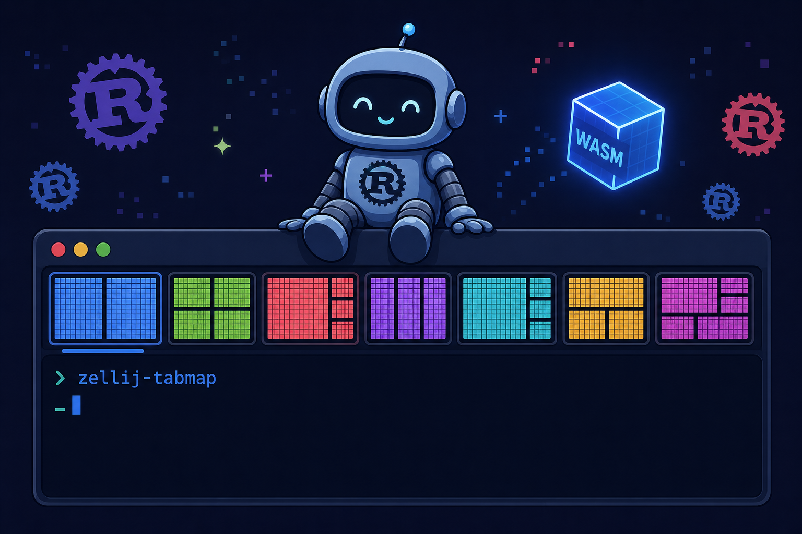
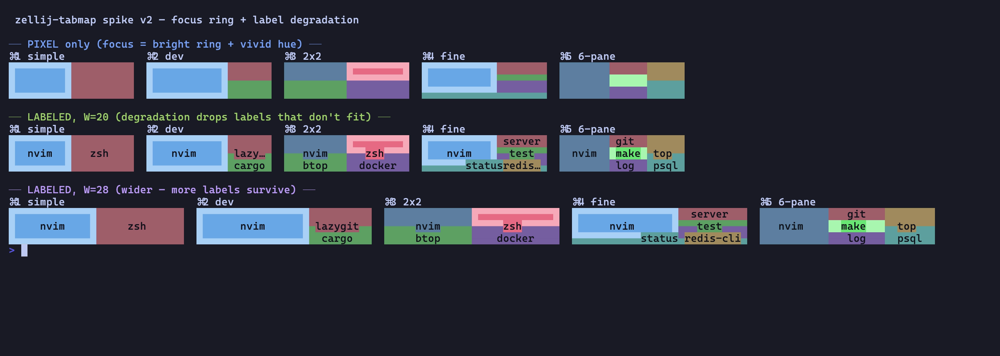

# zellij-tabmap



[](https://github.com/GeneralD/zellij-tabmap/actions/workflows/ci.yml)     

A [zellij](https://zellij.dev) plugin that replaces the thin one-row tab bar with a **taller, multi-row tab bar** in which every tab is drawn as a **color-coded minimap of its own pane layout** — a tiny pixel-grid thumbnail of how that tab's terminal is split. Panes are identified by color; where a tab is wide enough, a summarized title is overlaid; the `⌘N` switch hint is shown per tab.

## Preview



> The renderer rendered standalone in a terminal: five sample layouts (a single pane, a 2-column split, a 2-row split, a 2×2 grid, and a main+stack) shown as color-coded minimaps — pixel-only on top, with overlaid labels below at two widths. This renderer is now wired into the **live** zellij tab bar, including click-to-switch, and shipped in [`v0.1.0`](https://github.com/GeneralD/zellij-tabmap/releases/tag/v0.1.0) as a prebuilt wasm (see [Status](#status)).

## Why a color half-block grid?

Box-drawing rules can only place a line on a *cell boundary*. The upper-half-block glyph `▀` paints its **foreground color on the top half of a cell and its background color on the bottom half**, so the color can change *within* a single cell. That doubles the vertical resolution (a 3-text-row block becomes a 6-pixel-tall grid) and lets even finely split layouts render as distinct color bands instead of collapsing into noise. It's the same half-block technique image-to-terminal tools (chafa, timg) use, applied to a pane map.

```text
 3 text rows        left A (full height)   right: top B / bottom C, split by ▀
   row 1   │ █ A █ │ ▀▀▀   fg=B bg=B   (top & bottom both B)
   row 2   │ █ A █ │ ▀▀▀   fg=B bg=C   (top half B / bottom half C — split mid-cell)
   row 3   │ █ A █ │ ▀▀▀   fg=C bg=C   (top & bottom both C)
```

A focused pane is marked with a bright outline ring and a bold label — its fill keeps the same identity hue as when unfocused, so a pane never changes color as focus moves. Titles degrade gracefully — labels that cannot fit are dropped rather than truncated into noise.

## Status

🚧 **Early development.**

- ✅ The minimap renderer ([`src/minimap.rs`](src/minimap.rs)) is complete and unit-tested (HSL palette, half-block grid, focus ring, label degradation). It has **no zellij dependency**, so it runs and is tested on the native host.
- ✅ The full render pipeline is wired: every tab is projected from zellij's live `PaneManifest`, packed into column spans ([`src/line.rs`](src/line.rs)), assembled into a per-tab block at its budgeted width ([`src/tab_block.rs`](src/tab_block.rs)), and composed into the multi-row bar ([`src/paint.rs`](src/paint.rs)). By default the active tab is centered, so the strip slides to follow focus; set `align "left"` to anchor the row instead. Tabs that don't fit collapse into `← +N` / `+N →` end markers.
- ✅ Mouse click-to-switch is wired: a left click anywhere inside a tab's column span focuses that tab. The hit-test ([`src/line.rs`](src/line.rs)) maps the clicked column to the tab drawn there and converts its 0-based position to the 1-based index `switch_tab_to` expects, so it needs the `ChangeApplicationState` permission (see the first-run note below).
- ✅ [`v0.1.0`](https://github.com/GeneralD/zellij-tabmap/releases/tag/v0.1.0) is published with a prebuilt `zellij-tabmap.wasm` asset, so you can wire the plugin in by URL without building it — see [Use it in zellij](#use-it-in-zellij).

The full design — architecture, rendering pipeline, degradation ladder, golden-repo mapping, risks, and test strategy — lives in [`docs/design.md`](docs/design.md).

## Build from source

```bash
rustup target add wasm32-wasip1     # one time
cargo build --release               # .cargo/config.toml targets wasm32-wasip1
# artifact: target/wasm32-wasip1/release/zellij-tabmap.wasm
```

## Use it in zellij

In your layout's `default_tab_template`, give the tab-bar pane a height of 3 rows and point it at the hosted release artifact. zellij fetches and caches the wasm on first use — no clone, no build:

```kdl
default_tab_template {
    pane size=3 borderless=true {                       // 1 → 3 rows
        plugin location="https://github.com/GeneralD/zellij-tabmap/releases/latest/download/zellij-tabmap.wasm" {
            shortcut_prefix "⌘"
            active_width "24"
            align "center"                              // "center" slides to keep the active tab centered; "left" anchors the row (all-fit only)
            reorder "false"                             // drag a tab to reorder; "true" also needs RunActionsAsUser
            tab_gap "2"                                 // cleared columns between tab blocks; "0" packs them flush
            gradient "sheen"                            // pane fill sweep: "sheen" (L→R, default) / "weave" (alternating rows) / "off" (flat)
        }
    }
    children
    pane size=1 borderless=true { plugin location="status-bar" }
}
```

The hosted URL above always tracks the newest release. To pin a specific version instead, swap it for the per-tag form — e.g. `https://github.com/GeneralD/zellij-tabmap/releases/download/v0.1.0/zellij-tabmap.wasm`.

Contributors hacking on the plugin can [build from source](#build-from-source) and point at the local artifact instead:

```kdl
plugin location="file:/absolute/path/to/zellij-tabmap.wasm"
```

> **`align` — center vs left.** When every tab fits, `align` decides how the row is anchored: `center` (default) re-centers the active block on each focus change, so the whole strip slides horizontally; `left` pins the row's **left edge** at the start of the tab area (column 0, or just after any reserved prefix columns), removing that whole-strip slide. Note `left` does not freeze every tab's column — the active tab is still drawn wider than the inactives, so the tabs drawn after it shift right as focus crosses them; only the leftmost tab is truly fixed. `align` governs the all-fit case **only** — when tabs overflow, the visible window always follows the active tab (with `← +N` / `+N →` markers) regardless of `align`, because the active tab must stay on screen. The default stays `center` so existing layouts render unchanged on update.
>
> **`tab_gap` — space between tabs.** Leaves the given number of cleared columns between adjacent tab blocks so the boundary between screens reads clearly (default `2`). Set `0` to pack the blocks flush.
>
> **`gradient` — per-pane fill sweep.** `sheen` (default) sweeps each pane block's fill left-to-right from its base color toward a luminance-shifted shade (lighter for dark themes, darker for light ones); `weave` alternates the sweep direction on each half-block pixel row for a woven texture. The focus ring, labels, and the `⌘N` badge stay solid on top, so readability is unchanged. Set `off` for flat fills.
>
> **First-run permission note**: the bar needs two permissions — `ReadApplicationState` (pane/tab layout data) and `ChangeApplicationState` (click-to-switch) — but when loaded from `default_tab_template` it gets no usable permission prompt: the bar pins itself as a non-selectable pane, so the prompt can't be focused or accepted, and it appears inert on first launch (see also the related upstream issue [zellij#4982](https://github.com/zellij-org/zellij/issues/4982), which tracks the same dead-end for background plugins). To grant the permissions, load the plugin **once in a regular pane** — the prompt shows there and the grant is cached per URL:
>
> ```bash
> zellij plugin -- https://github.com/GeneralD/zellij-tabmap/releases/latest/download/zellij-tabmap.wasm
> ```
>
> Press <kbd>y</kbd> to accept and close the pane, then restart the session so the template-loaded bar picks up the grant. Note the grant is keyed on the **exact plugin URL**, so a version-pinned URL needs this once per version, while the `latest` URL needs it only once (at the cost of zellij's URL-keyed wasm cache holding back updates). As a fallback you can also add the entry by hand to `permissions.kdl` in zellij's cache directory (Linux: `~/.cache/zellij/permissions.kdl`, macOS: `~/Library/Caches/org.Zellij-Contributors.Zellij/permissions.kdl`) — the file is read once at server startup, so manual edits take effect only in a fresh session.
>
> **Enabling `reorder`** requests a third permission, `RunActionsAsUser` (for the `MoveTabByTabId` action a tab drag performs). Granting is all-or-nothing for tab-template plugins, so when you set `reorder "true"` you must grant all three permissions and reload — otherwise the bar freezes with no prompt. Left at the default (`false`), the plugin requests only the two permissions above, so an existing install keeps working unchanged across updates.

## Development

```bash
cargo test  --lib --target "$(rustc -vV | sed -n 's/host: //p')"   # native unit tests
cargo clippy --target wasm32-wasip1 --all-features --lib            # lint (CI denies warnings)
cargo build --release --target wasm32-wasip1                        # the loadable wasm
```

CI runs the same three on every push; tagging `vX.Y.Z` builds the wasm, generates a changelog with [git-cliff](https://github.com/orhun/git-cliff), and attaches the artifact to a GitHub Release.

## Acknowledgements

Structured after [`KiryuuLight/zellij-attention`](https://github.com/KiryuuLight/zellij-attention), used as a golden-repository reference for the Rust/WASM zellij-plugin layout (thin `register_plugin!` bin + native-testable lib + FFI-stubbed tests + CI/release workflows).

## License

[MIT](LICENSE)
